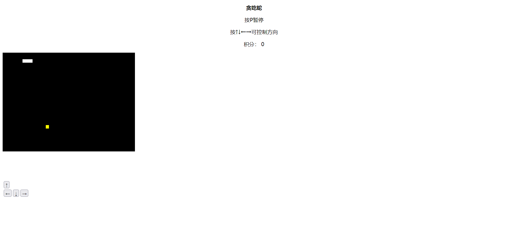

<<<<<<< HEAD
# 来试试完善“贪吃蛇”吧
欢迎各位21级学弟学妹来尝试我们校科协前端组的试题~

暑假闲着无事可做的王同学想到了一个好主意，开发一个可供多人同时游玩的贪吃蛇，和朋友一起玩，那一定很有趣吧。说干就干，经过一顿操作，王同学终于部署好了线上版本。可是当他想和他的好朋友一起快乐时，突然发现了BUG！这是怎么回事呢？机智的王同学经过查看修改时间，发现居然有人通过某种不知名手段半夜删他代码！这可急坏了王同学，可是这个时候王同学突然接到了锅，作为乙方自然是不能怠慢了甲方爸爸，但是这边已经完成了大半的贪吃蛇也不能落下。于是，他想到了聪明的你，相信你一定能够将这些小BUG斩于马下，帮他完成这个项目。
# 目标
## 【必做】
* 游戏的主界面和方向键处于网页左端，而且上方向键还不是居中！这可太影响体验了，用户体验也是前端的一门大学问呢，希望你能到CSS文件里将整个它们移动到视角中央哦。
  
* 在优化好布局后，小王发现不知道是被删了哪段代码，小蛇吃到食物后长度居然不会增加了，希望你能帮他修好这个bug。
* 小蛇好不容易吃到了食物，在多次进食后也成功增加了身体长度，但此时却不知道吃了多少食物（拿到了多少积分），让分数显示出来，获得满满的成就感吧！
* 在每一次小蛇撞墙或者倒退后，游戏都会结束弹出提示框，可是每次结束后刷新一下页面才能重新开始游戏，请你在规定的两处加一些代码，好让玩家在关闭提示框后进入下一次游戏。
## 【选做五选三】
* 有些玩家习惯于方向键操控，而有的玩家更喜欢WASD操控，请你在规定处加上一些代码，使小蛇同时也能被WASD键操控。
* 小王同学似乎在愉快地玩耍时似乎忘了一件事，有的朋友是手机用户，因此没法使用方向键或者WASD操控。但是小王同学还是留了一手，请你在HTML文件里实现按键功能。  

* 不管怎么说，这个界面实在是太古老了，像是二十年前的网页游戏！请你试着在游戏界面和方向键保持居中的情况下修改它的样式，让它变得更好看。
* 小蛇每次都出生在同一个地方，未免有些无聊了，你能让它随机出生使游戏变得更有趣吗？
* 在精英玩家眼里，小蛇移动的速度太慢了，毫无趣味性可言，你能使其的速度随着游戏积分的增加而变快吗？
# 文件结构
```
.
│  myScript.js          js脚本
│  myStyle.css          式样表
│  README.md            帮助文件
│  贪吃蛇.html
│
└─img
        1.png
        2.png
```
# 如何提交
私戳这几位前端组讲师都可以哟，我们的QQ分别是：  
* 王畅：2279600314  
* 栗浩铭：312176896  
* 朱文灏：2524332942  
* 刘宏晖：2587188250  
# 如果想完成这些，我大概需要学习什么
* HTML基础知识
* CSS基础知识
* JavaScript基础知识
* Chrome的开发者工具（DevTools）的使用
# 可能需要的参考资料
HTML与CSS是网页开发的基础，简单易上手，下面的教程会帮助你快速掌握必备的基础知识，前两个是文档类型，第三个是MOOC上的免费网课，能够自己动手实践，学习效率较高。  
* HTML基础知识：http://www.w3school.com.cn/html/html_jianjie.asp
* CSS基础知识：http://www.w3school.com.cn/css/index.asp
* HTML+CSS基础课程：https://www.imooc.com/learn/9  

接下来就是前段开发的重中之重：JavaScript，初次接触这类语言可能有些难度，但本次试题仅用到了最基础的知识，相信你一定能够学会哦！
* JavaScript基础：http://www.w3school.com.cn/js/index.asp https://www.imooc.com/learn/10  

另外，用好浏览器的开发者工具（DevTools）也是前端工程师的必备技能哦，在这里我们只推荐Chrome 浏览器，因为具有较好的兼容性，速度快，DevTools优秀且强大，下面附上下载地址以及DevTools 的使用方法：
* Chrome 下载地址：https://www.google.com/intl/zh-CN/chrome/
* DevTools 介绍：https://developers.google.com/web/tools/chrome-devtools/?hl=zh-cn

有什么其他问题欢迎私戳几位讲师哦~  
# 我如何在本地编写我的代码
在此我们只推荐了Visual Studio Code，它是一款免费开源的现代化轻量级代码编辑器，支持几乎所有主流的开发语言的语法高亮、智能代码补全、自定义快捷键、括号匹配和颜色区分、代码片段、代码对比 Diff、GIT命令等特性，支持插件扩展，并针对网页开发和云端应用开发做了优化，是前端开发的利器。
=======
# Greedy-snake
My testwork
>>>>>>> 8371c4a3416cf8733512adafb335bbbec52a2af1
